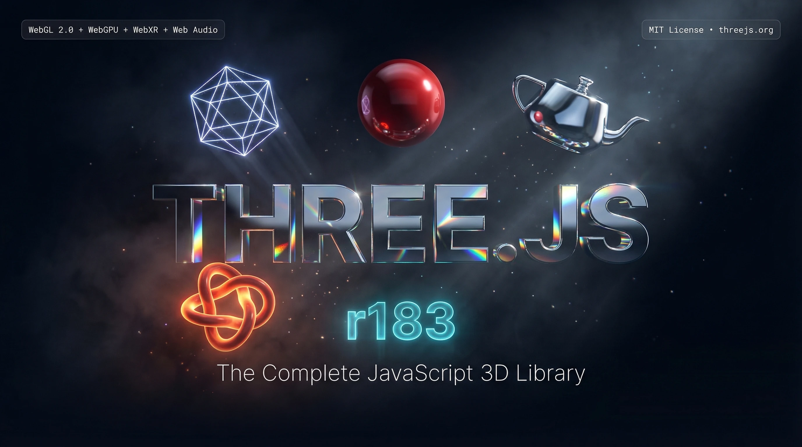
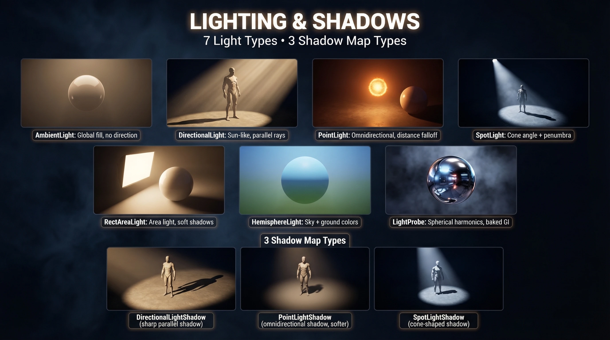
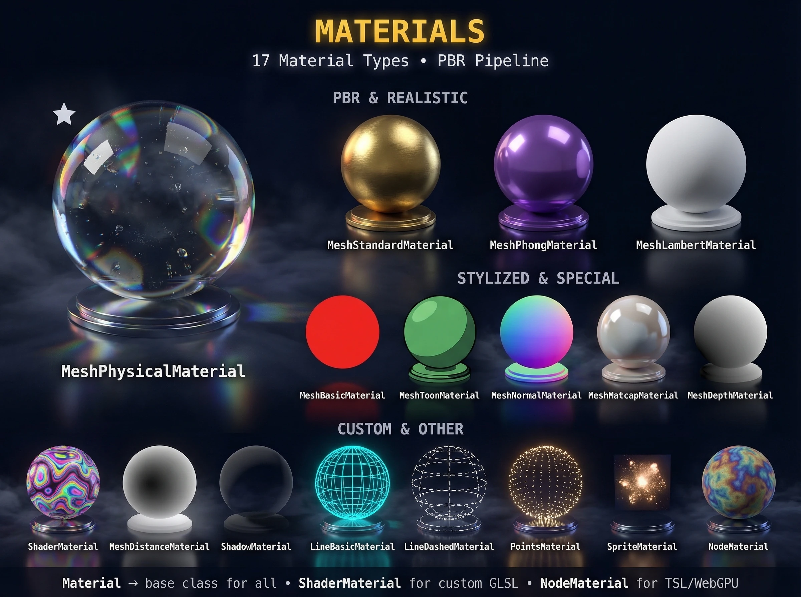
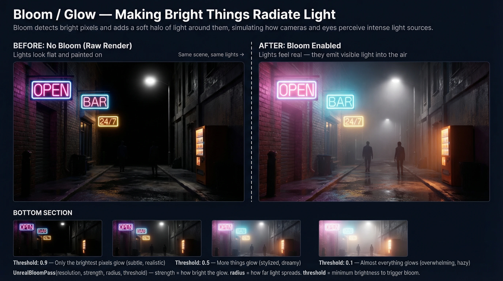
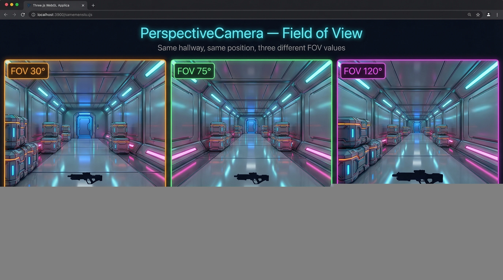
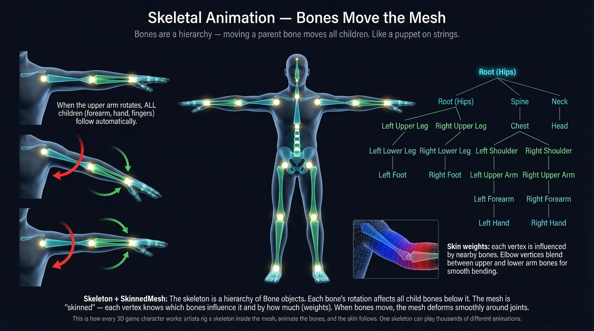
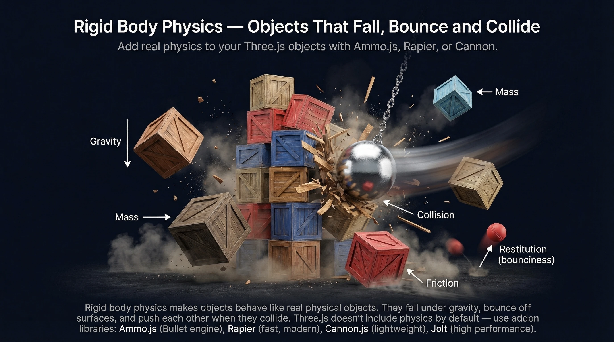

# Three.js Visual Encyclopedia

> Built by [@AIOnlyDeveloper](https://x.com/AIOnlyDeveloper) — follow for more Three.js content, visual guides, and browser game development.

 

**96 illustrated breakdowns covering every major Three.js concept.** Geometry, materials, cameras, shaders, post-processing, physics, audio, loaders, helpers and more. Designed for visual learners — just scroll.

 

## Sample Slides

<table>
  <tr>
    <td></td>
    <td></td>
    <td></td>
  </tr>
  <tr>
    <td></td>
    <td></td>
    <td></td>
  </tr>
</table>

 

## What's Inside

| # | Section | Topics |
|---|---------|--------|
| 01 | Architecture | Scene graph, render loop, core classes |
| 02 | Geometry | 21 built-in types, BufferGeometry, custom shapes |
| 03 | Materials | MeshBasicMaterial to MeshPhysicalMaterial, PBR |
| 04 | Lighting | 7 light types, shadow maps, IBL |
| 05 | Objects | Mesh, Group, SkinnedMesh, Sprite, LOD, Instancing |
| 06 | Cameras | PerspectiveCamera, OrthographicCamera, CubeCamera |
| 07 | Textures | UV mapping, PBR texture sets, HDR, compressed KTX2 |
| 08 | Renderer | WebGL vs WebGPU, tone mapping, anti-aliasing |
| 09 | Post-Processing | Bloom, SSAO, depth of field, motion blur, LUTs |
| 10 | Controls | OrbitControls, FirstPersonControls, PointerLockControls |
| 11 | TSL | Three.js Shading Language - node-based shaders |
| 12 | Animation | Keyframes, skeletal animation, morph targets |
| 13 | Audio | Spatial audio, AudioAnalyser, audio cones |
| 14 | Special Objects | Water, Sky, Reflector, CSS3D, Raycaster, Particles |
| 15 | Loaders | GLTFLoader, FBXLoader, OBJLoader, DRACOLoader |
| 16 | Physics | Rigid body, cloth, vehicle physics, ragdolls |
| 17 | Helpers | Grid, Camera, Light, Skeleton helpers |
| 18 | Curves | Bezier, CatmullRom, Shape + Extrude |
| 19 | Math | Vectors, Quaternions, Matrix4, Euler |

---

## Found Something Wrong?

Images were generated with AI and may contain inaccuracies. If you spot an error in a diagram — wrong label, incorrect description, misleading illustration — please open a PR or issue.

**How to fix an image:**
1. Fork this repo
2. Replace the file in `images/encyclopedia/` (WebP, 16:9)
3. Open a PR describing what was wrong and what you fixed

**How to fix text:**
1. Open `index.html`
2. Find the `
` for the relevant entry
3. Fix the description and open a PR

---

## Follow for More

Built by [@AIOnlyDeveloper](https://x.com/AIOnlyDeveloper) — follow for more Three.js content, visual guides, and browser game development.

---

## Tech Stack

- Static HTML/CSS/JS — no build step, no framework
- 96 WebP slides at q=90 (~36MB total)
- Hosted on GitHub Pages
- Images generated with Google Gemini 3 Pro

## License

MIT
